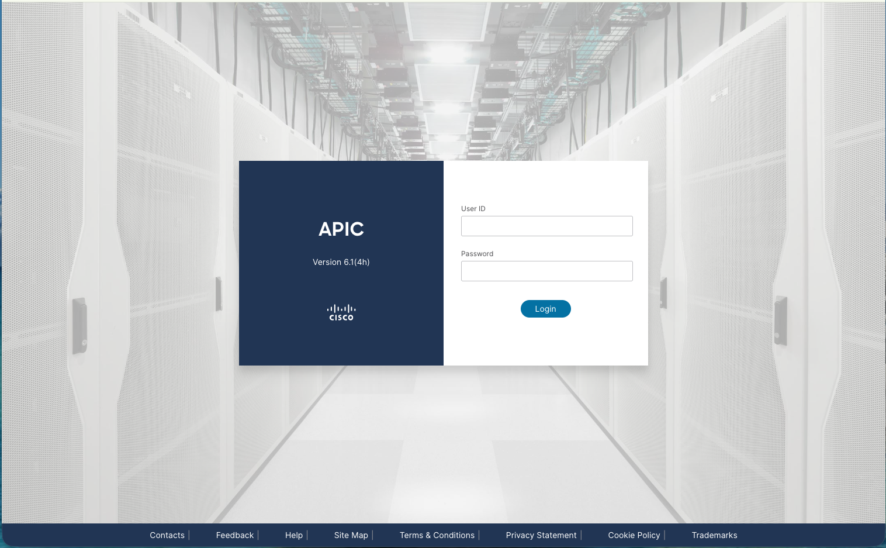

# Cisco ACI VMM-Lite Integration for Red Hat OpenShift

## Reference Architecture & Deployment Guide

This repository contains the complete technical blueprints, deployment manifests, and automation scripts used to validate the integration of **Cisco ACI VMM-Lite (Chained Mode)** with **Red Hat OpenShift**. The test has been perfomed in an environment running OpenShift version 4.20 and uses the ACI Simulator 6.0 available at Cisco DevNet.

---

## 1. Executive Summary & Architectural Overview

### The Migration Challenge
In traditional enterprise data centers, network infrastructure management is often centralized within the network security operations team using **Cisco ACI Application Policy Infrastructure Controllers (APIC)**. When migrating workloads from VMware ESXi to Red Hat OpenShift Virtualization, a critical architectural challenge emerges: maintaining seamless, policy-driven network provisioning for Virtual Machines without disrupting existing operational structures or forcing the network team to manage Kubernetes manifests.

### The Solution: Cisco CNO VMM-Lite (Chained Mode)
Source: https://www.cisco.com/c/en/us/td/docs/dcn/aci/containers/cno/cno-vmmlite-user-guide.html
To bridge this operational gap, Cisco developed the **Cisco Network Operator (CNO) VMM-Lite** functionality. This specialized operator provides a non-intrusive, infrastructure-led integration model known as **Chained Mode** or **Secondary CNI**. 

This tool was designed precisely for clients migrating from VMware + ACI VMM environments who want to maintain their exact current infrastructure workflows. Unlike a full CNI replacement where Cisco ACI replaces the entire default Kubernetes networking stack, VMM-Lite leaves the primary cluster network engine completely untouched:

* **Primary Network Control Plane**: Red Hat OpenShift retains its native, highly optimized **OVN-Kubernetes CNI** to handle all internal cluster networking, master-to-worker core communications, service load balancing, and secure ingress routing.
* **Secondary Network Data Plane**: Cisco CNO VMM-Lite acts as a specialized automation clerk. It opens a secure, persistent WebSocket channel to the Cisco APIC APIs, monitors for specific hardware policy mutations (specifically EPGs and AAEPs assigned to the OpenShift nodes), and leverages **Multus CNI** to dynamically provision Layer 2 networks via Network Attachment Definitions (NAD) exclusively for external attachments like Virtual Machines.

### Key Integration Benefits
* **Preservation of Operational Boundaries**: The network infrastructure team continues to orchestrate networks, VLAN allocation, security domains, and endpoint groups centrally from the ACI APIC GUI or API pipelines, replicating almost 100% of the VMware operational experience.
* **Dynamic Policy Reconciliation**: When an engineer provisions or amends an Endpoint Group (EPG) in ACI and tags it with a target Kubernetes metadata namespace annotation, the CNO operator intercepts the event and automatically translates it into a local Kubernetes **NetworkAttachmentDefinition (NAD)** object.
* **Zero Cluster Control Plane Intrusion**: Because the core cluster nodes communicate over native OVN-Kubernetes paths, any infrastructure modification or firmware update on the Cisco ACI fabric cannot destabilize core Kubernetes cluster operations.

---

## 2. Core Component Blueprint

The integration architecture relies on four main software and hardware definition layers to bind the physical network fabric to the OpenShift virtualization runtime:

1. **Cisco Network Operator (CNO) VMM-Lite**: The central controller deployed inside the `aci-containers-system` namespace. It authenticates against the APIC controller via signature-based cryptographic keys and coordinates configuration tracking.
2. **Multus CNI Engine**: The standard Kubernetes Multi-Network plugin that allows individual Pods and Virtual Machine instances to attach to multiple isolated hardware network interfaces simultaneously.
3. **`AaepMonitor` Custom Resource**: A dedicated cluster-wide singleton object utilized by the CNO operator to discover and monitor the explicit physical **Attachable Access Entity Profiles (AAEP)** matching the physical network switch cables plugged into the back of the bare-metal servers.
4. **Host Linux Bridge (`br-nad`)**: A declarative, kernel-level software bridge deployed across the operating system layer of the OpenShift worker nodes via the **Kubernetes NMState Operator**, functioning as a physical or virtual trunk interface to pass Layer 2 frames.

---

## 3. Sandbox Lab Simulation Setup

To validate this architecture end-to-end within a virtualized demonstration or pipeline environment (such as a Single Node OpenShift (SNO) instance) without requiring a physical switch fabric, the deployment leverages a **Cisco DevNet Sandbox running ACI Simulator 6.0**. The standard "Always-On" sandbox model cannot be used because it is read-only and prevents object creation.

### Automated VPN Tunnel Bridge Pod Deployment
Because an SNO instance hosted in a virtual cloud platform lacks secondary physical network adapters physically wired to real Cisco Nexus hardware, a dedicated cloud-native proxy bridge pod must be deployed to simulate control plane reachability. 

Execute the following manifests to provision the dedicated `cisco-vpn` namespace, instantiate a secure DTLS tunnel using `openconnect`, and map automated port forwarding via `socat` to safely expose the APIC API endpoints inside the cluster host network space.

#### 1. Define Namespace and Secrets
Save as `cisco-vpn-setup.yaml` and apply to the cluster:

```yaml
apiVersion: v1
kind: Namespace
metadata:
  name: cisco-vpn
spec: {}
---
apiVersion: v1
kind: Secret
metadata:
  name: cisco-vpn-connection
  namespace: cisco-vpn
type: Opaque
stringData:
  server: "<<< VPN SERVER >>>"         # ==> REPLACE with the provided by Cisco DevNet Sandbox
  user: "<<< VPN USER >>>"             # ==> REPLACE with your sandbox VPN username
  password: "<<< VPN_PASSWORD >>>"     # ==> REPLACE with your sandbox VPN credentials
```

#### 2. Deploy Automated Tunnel Engine
Save as `cisco-vpn-bridge-pod.yaml` and apply:

```yaml
apiVersion: v1
kind: Pod
metadata:
  name: cisco-vpn-bridge
  namespace: cisco-vpn
spec:
  hostNetwork: true
  containers:
  - name: vpn-client
    image: fedora:latest
    securityContext:
      privileged: true
    env:
    - name: VPN_SERVER
      valueFrom:
        secretKeyRef:
          name: cisco-vpn-connection
          key: server
    - name: VPN_USER
      valueFrom:
        secretKeyRef:
          name: cisco-vpn-connection
          key: user
    - name: VPN_PASSWORD
      valueFrom:
        secretKeyRef:
          name: cisco-vpn-connection
          key: password
    command:
      - /bin/sh
      - -c
    args:
      - |
        # 1. Update package managers and provision system utilities
        dnf install -y openconnect net-tools iproute socat
        
        echo "Launching automated Port-Forwarding bridge via socat..."
        # 2. Bind background socat to translate local cluster port 8443 to APIC SSL 443
        socat TCP6-LISTEN:8443,fork,reuseaddr TCP:10.10.20.14:443 &
        
        echo "Starting automated Cisco VPN connection..."
        # 3. Initialize openconnect in the foreground to persist the pod runtime lifecycle
        echo "$VPN_PASSWORD" | openconnect "$VPN_SERVER" \
          --user="$VPN_USER" \
          --authgroup="SSLClient" \
          --passwd-on-stdin \
          --non-inter
```

#### 3. Accessing the APIC Interface Locally
To safely audit the APIC configuration panel from a local engineering station, bridge the cluster proxy pod to your machine using the OpenShift CLI port-forward mechanism:

```bash
oc port-forward cisco-vpn-bridge 8443:8443 -n cisco-vpn
```

Open a local web browser and navigate to `https://localhost:8443`. You can now authenticate using the assigned administrative sandbox credentials. You will see the main APIC login screen: 



---

## 4. Declarative Host Layer Network Policies (NMState)

Before the Cisco CNO operator can securely link a discovered fabric VLAN to a local Virtual Machine interface, a matching kernel bridge interface must exist across the target cluster node operating systems. In Red Hat OpenShift, host-level network engineering is managed declaratively via the **Kubernetes NMState Operator**.

### SNO Simulation Bridge Blueprint (Port-Less Mode)
By omitting the physical `port` definition block within the NMState policy manifest, the host engine safely initializes a fully functional virtual software bridge interface named `br-nad`. This allows Multus bindings and container interfaces to attach and pass local traffic within memory without risking network disruption or cutting off host cloud connectivity.

#### 1. Deploy the Kubernetes NMState Operator Stack
Save as `nmstate-operator.yaml` and apply to initialize the engine components:

```yaml
apiVersion: v1
kind: Namespace
metadata:
  name: openshift-nmstate
  finalizers:
    - kubernetes
---
apiVersion: operators.coreos.com/v1
kind: OperatorGroup
metadata:
  name: openshift-nmstate
  namespace: openshift-nmstate
spec:
  targetNamespaces:
    - openshift-nmstate
---
apiVersion: operators.coreos.com/v1alpha1
kind: Subscription
metadata:
  name: kubernetes-nmstate-operator
  namespace: openshift-nmstate
spec:
  channel: stable
  installPlanApproval: Automatic
  name: kubernetes-nmstate-operator
  source: redhat-operators
  sourceNamespace: openshift-marketplace
```

#### 2. Instantiate the Core Engine Singleton
Save as `nmstate-singleton.yaml` and apply to distribute the host configuration daemons:

```yaml
apiVersion: nmstate.io/v1
kind: NMState
metadata:
  name: nmstate
```

#### 3. Apply the Declarative Virtual Host Policy
Save as `nmstate-bridge-policy.yaml` and apply:

```yaml
apiVersion: nmstate.io/v1
kind: NodeNetworkConfigurationPolicy
metadata:
  name: br-nad-bridge-policy
spec:
  nodeSelector:
    kubernetes.io/os: linux
  desiredState:
    interfaces:
      - name: br-nad
        type: linux-bridge
        state: up
        bridge:
          options:
            stp:
              enabled: false
```

Verify that the policy states have compiled successfully by executing:
```bash
oc get nncp br-nad-bridge-policy
```
> **Expected Status Outcome**: `SuccessfullyConfigured`

---

## 5. Operator Configuration & Automated Generation

The generation of the VMM-Lite controller manifests is driven by Cisco's specialized deployment utility, **`acc-provision`**. This CLI tool processes a centralized infrastructure parameters file to compile the entire target Kubernetes resource bundle. We need first to install the tool: 

```bash
pip install acc-provision
```

### Structural Input Files Compilation

#### 1. Define the Global Integration Profile (`acc-provision-input.yaml`)
Create the input configuration layout. Note that the **`kubeapi_vlan`** field is intentionally **omitted** from this definition file. In a VMM-Lite Chained Mode deployment, `kubeapi_vlan` is a legacy flag; because the primary host network is independently orchestrated by OVN-Kubernetes, the CNO operator completely ignores it.

```yaml
aci_config:
  apic_hosts:
    - X.X.X.X                     # ==> REPLACE with the IP given by the Cisco sandbox for the admin user.
vmm_lite_config:
  aaep_monitoring_enabled: True
  bridge_name: "br-nad"
  cno_identifier: "cno-id1"
  bridge_nad_config_file: "bridge_cni_config.yaml"
  apic_username: "admin"
```

#### 2. Define the Low-Level Network Engine Template (`bridge_cni_config.yaml`)
Create the secondary network attachment rules mapping file. 

**Note on `hairpinMode: false`**: The `hairpinMode` flag dictates whether a Linux bridge interface allows a packet to pull an immediate 180-degree U-turn and return through the exact same virtual port it originated from. While this capability is mandatory for primary container service layers, it is set to **false** for the secondary Cisco network. This maintains standard, secure, loop-free switching behavior for dedicated Virtual Machines.

```yaml
isGateway: false
isDefaultGateway: false
forceAddress: false
mtu: 1500
ipMasq: false
hairpinMode: false
promiscMode: false
enabledad: false
disableContainerInterface: false
portIsolation: false
ipam:
  type: host-local
  subnet: 10.1.1.0/24
```

---

## 6. Security Hardening & APIC Authentication Workarounds

### Analyzing Sandbox API Limits (REST Error Code 107)
When executing the compilation script with automated fabric injection commands:
```bash
export PASSWORD="<<< VPN_PASSWORD >>>"      # ==> REPLACE <<< VPN_PASSWORD >>> with the admin password provided by the ACI Simulator 6.0. 
acc-provision -a \
  -c acc-provision-input.yaml \
  -f openshift-vmm-lite-baremetal \
  -u admin \
  -p $PASSWORD \
  -o aci_deployment_vmm_lite.yaml
```
The routine may complete manifest generation but fail to communicate with the simulator fabric, throwing the following exception:
```text
ERR:  Max retries reached for POST request to /api/node/mo/uni/userext/user-admin.json.
ERR:  Error in provisioning: APIC REST Error: {'attributes': {'code': '107', 'text': 'User admin privileges cannot be changed'}}
```
This failure occurs because public sandbox environments explicitly implement read-only security gates across local user privilege structures. The script is blocked from programmatically uploading the runtime authentication certificates to the root `admin` account profile.

### The Remediation Workflow (Manual Key Injection)
To bypass this limitation and establish authenticated WebSocket tunnels, the operator public key certificate must be injected manually via the APIC console interface:

1. Locate the public certificate file (`user-admin.crt`) generated locally on your file system by the tool execution pass. Open it with a text editor and copy the entire string block.
2. Log into the APIC console at `https://localhost:8443`.
3. From the primary menu array, select **Admin ➔ AAA ➔ Users** and then the **Local** tab.
4. Click on the user profile row designated for **`admin`**.
5. Within the dropdown on the right side of the window, click on **Edit** and then in **Advanced Settings** and finally on **Add X509 Certificate**.  
7. Click the **+ (Add)** button:
   * **Name**: `user-admin`
   * **Certificate Data**: Paste the public key block exactly as copied.
8. Click **Submit**.

### Production-Grade Hardening Alternative (Dedicated GitOps Accounts)
In production corporate fabrics, altering the core administrative user is strictly prohibited. Infrastructure teams deploy a dedicated, long-lived automation account using explicit cryptographic signature keys. Instead of generating random credentials, you map the `acc-provision-input.yaml` manifest to a pre-existing 10-year certificate pair via the `sync_login` block:

```yaml
aci_config:
  apic_hosts:
    - X.X.X.X                     # ==> REPLACE with the IP given by the Cisco sandbox for the admin user.
  sync_login:
    username: "openshift-operator-svc"
    certfile: "/usr/local/etc/aci-cert/production-user.crt"
    keyfile: "/usr/local/etc/aci-cert/production-user.key"
```

---

## 7. Validation & End-to-End Operational Lifecycle

Once the finalized deployment manifest is generated, push the structural operator configurations to the cluster:
```bash
oc apply -f aci_deployment_vmm_lite.yaml
```

To bind the cluster monitoring daemons to the virtual hardware interfaces, create the **`AaepMonitor`** object. This ensures the operator tracks the relevant physical advancement profiles (e.g., `Heroes_phys` and `SnV_phys` profiles):

```yaml
apiVersion: aci.attachmentmonitor/v1
kind: AaepMonitor
metadata:
  name: aaepmonitor
  namespace: aci-containers-system
spec:
  aaeps:
    - Heroes_phys
    - SnV_phys
```

### The Validation Checklist Pipeline

#### Phase 1: Fabric Object Initialization & Annotation Mapping
Log into the APIC console interface, navigate to your active Tenant workspace, select an **Application EPG** (such as `vm-integration-vlan120`), and navigate to the **Static AAEP** folder mapping. Select your targeted physical profile domain (`Heroes_phys`) and bind an initial VLAN ID tag (e.g., `131`).

To trigger the automation sync, annotate the EPG object metadata property:
* **Key**: `cno-id1-namespace`
* **Value**: `cisco-integration-vlan120`

#### Phase 2: OpenShift Dynamic Reconciliation Verification
Execute the following search query within the target namespace to confirm that the CNO operator successfully processed the WebSocket frame and auto-generated the matching Multus configuration:

```bash
oc get network-attachment-definitions -n cisco-integration-vlan120
```

To audit the underlying JSON config structure and verify that the VLAN ID has been injected cleanly, run:
```bash
oc get network-attachment-definition -n cisco-integration-vlan120 -o jsonpath='{.items[0].spec.config}' | jq
```

#### Phase 3: Live Propagation & Modification Tracking
Return to the APIC interface panel, modify the active **Encap** and **Primary Encap** VLAN parameters, shifting the tag from value **`131`** down to **`120`**, and click **Submit**.

Re-execute the OpenShift JSON inspection utility. The CNO operator will automatically update the target object parameters in place without needing a restart or manual intervention:
```bash
oc get network-attachment-definition -n cisco-integration-vlan120 -o jsonpath='{.items[0].spec.config}' | jq .vlan
```
> **Output Result**: `120`

#### Phase 4: Dynamic Propagation Cleanup Verification
Delete the Application EPG from the Cisco APIC console tree. Run an administrative query against the OpenShift cluster namespace:

```bash
oc get network-attachment-definitions -n cisco-integration-vlan120
```
> **Expected Final Outcome**: `No resources found.`

This confirms that the automated network lifecycle cleanup is working perfectly and the integration is ready for production use.
